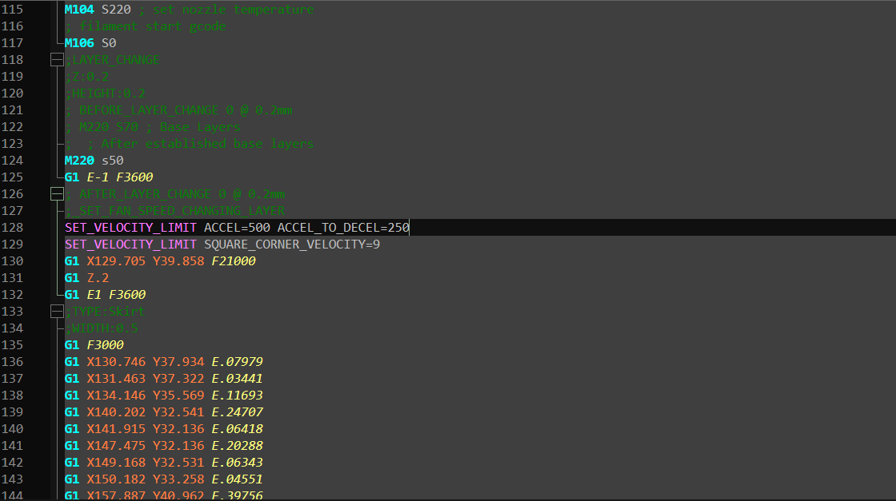

# Klipper-GCODE-Dark
Klipper GCODE syntax highlighting for Notepad ++ with UDL2.0

To install this syntax highlighter:

  1.  Make sure you have installed notepad++ 6.x.x to use the new user defined languages
  2.  Download the gcode.xml file 
  3.  In Notepad++, go to the "Language"->"Define Your Language..." dialog
  4.  Click "Import", then browse to the downloaded file. If you see "Import was successful", then the syntax highlighter is installed.

